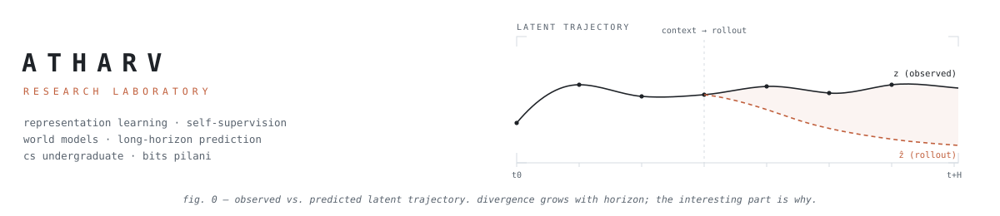
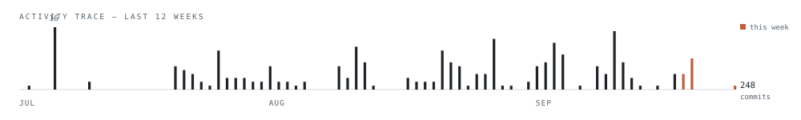
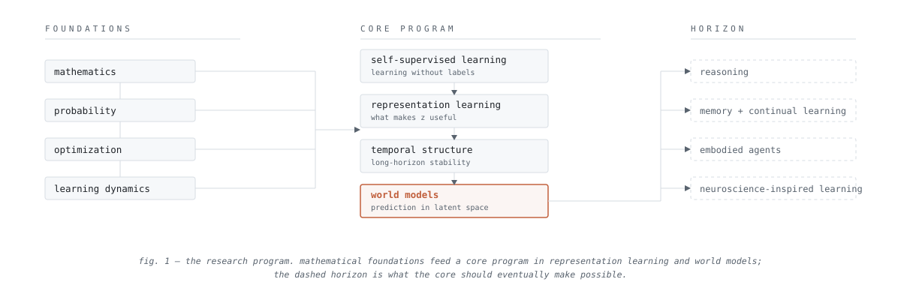
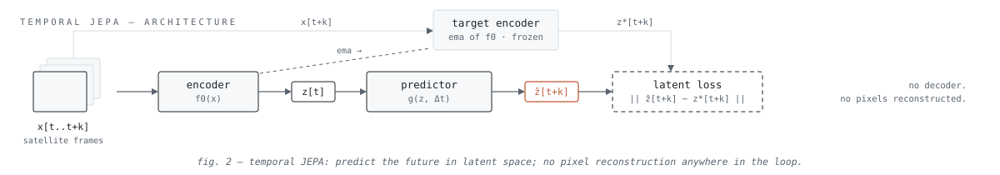
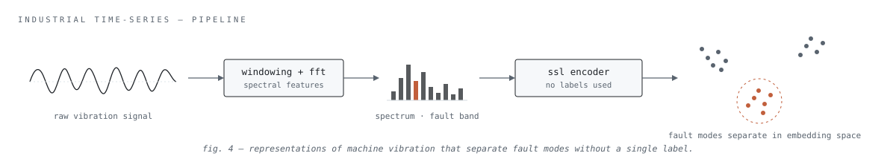

<!-- GENERATED FILE — do not edit. Edit templates/, research/, papers/,
     projects.yml instead; scripts/build_readme.py rebuilds this. -->
<picture>
  <source media="(prefers-color-scheme: dark)" srcset="assets/lab/banner-dark.svg">
  
</picture>

<table>
<tr>
<td width="62%" valign="top">
<samp>FRONT&nbsp;MATTER</samp>  
Second-year CS undergraduate at BITS Pilani, working toward frontier AI research in representation learning and world models.  
The method is fixed even when the subject isn't: read the paper, rebuild it from scratch, reproduce the result, find the hidden assumptions — then look for where they break. Everything in this repository exists to run that loop faster.  
<samp>mathematics&nbsp;→&nbsp;theory&nbsp;→&nbsp;paper&nbsp;→&nbsp;implementation&nbsp;→&nbsp;reproduction&nbsp;→&nbsp;experiment&nbsp;→&nbsp;failure&nbsp;analysis&nbsp;→&nbsp;original&nbsp;ideas</samp>
</td>
<td width="38%" valign="top">
<samp>COORDINATES</samp>  
<samp>field&nbsp;&nbsp;&nbsp;representation learning, &nbsp;&nbsp;&nbsp;&nbsp;&nbsp;&nbsp;&nbsp;&nbsp;world models 
lab&nbsp;&nbsp;&nbsp;&nbsp;&nbsp;<a href="https://github.com/atharvgaur1845?tab=repositories">repositories</a> 
site&nbsp;&nbsp;&nbsp;&nbsp;<a href="https://atharvgaur1845.github.io">atharvgaur1845.github.io</a> 
in&nbsp;&nbsp;&nbsp;&nbsp;&nbsp;&nbsp;<a href="https://www.linkedin.com/in/atharv-gaur-a9ab3627a">atharv-gaur</a> 
x&nbsp;&nbsp;&nbsp;&nbsp;&nbsp;&nbsp;&nbsp;<a href="https://x.com/tarkrishi">@tarkrishi</a></samp>  
<samp>values&nbsp;&nbsp;evidence over hype · &nbsp;&nbsp;&nbsp;&nbsp;&nbsp;&nbsp;&nbsp;&nbsp;depth over breadth · &nbsp;&nbsp;&nbsp;&nbsp;&nbsp;&nbsp;&nbsp;&nbsp;originality over replication</samp>
</td>
</tr>
</table>

### <samp>01 · current investigation</samp>

<!-- ros:current -->
<table>
<tr><td valign="top" width="130"><samp>FOCUS</samp></td><td>temporal JEPA for satellite time-series</td></tr>
<tr><td valign="top" width="130"><samp>STATUS</samp></td><td>building — training scaffold up, instrumenting rollouts</td></tr>
<tr><td valign="top" width="130"><samp>SINCE</samp></td><td>2026-06-30</td></tr>
<tr><td valign="top" width="130"><samp>REPO</samp></td><td><a href="https://github.com/atharvgaur1845/multi_temporal_jepa">multi_temporal_jepa</a></td></tr>
<tr><td valign="top" width="130"><samp>HYPOTHESIS</samp></td><td>Latent prediction without reconstruction keeps the information that matters
for downstream temporal reasoning — and its failure mode (collapse or
divergence) is measurable long before accuracy metrics notice.</td></tr>
<tr><td valign="top" width="130"><samp>LATEST</samp></td><td>Multi-temporal JEPA scaffold trains end-to-end on satellite sequences.
Next measurement: how prediction error in latent space grows with rollout
horizon, per spectral band.</td></tr>
</table>

<samp>auto · research/current.md · rebuilt on push + daily</samp>
<!-- /ros:current -->

### <samp>02 · lab notebook</samp>

<!-- ros:notebook -->
<table>
<tr><td valign="top" width="110"><samp>2026-07-21</samp></td><td><b>rollout instrumentation for multi-temporal JEPA</b> <samp>#experiment</samp> Wired divergence logging into the training loop so latent prediction error is tracked per horizon step, per band, at every checkpoint — not computed after the fact. If the hypothesis is that collapse announces itself early, the instrument has to be running from step zero.</td></tr>
<tr><td valign="top" width="110"><samp>2026-07-11</samp></td><td><b>predictor capacity is not free</b> <samp>#experiment #failure</samp> Doubling predictor depth looked like a clean win on one-step prediction and quietly wrecked long-horizon rollouts — the predictor started memorizing trajectory quirks instead of dynamics. Lesson recorded: evaluate at the horizon you care about, never at the horizon that is cheap.</td></tr>
<tr><td valign="top" width="110"><samp>2026-07-02</samp></td><td><b>why JEPA over masked autoencoding, in one paragraph</b> <samp>#reading</samp> Reconstruction objectives spend capacity on exactly the pixels I don't care about (clouds, sensor noise); predicting in latent space lets the encoder discard them. The open question I keep circling: without reconstruction, what stops the latent from discarding too much? That question is the project.</td></tr>
</table>

<samp>auto · last 3 of research/notebook.md · <a href="research/notebook.md">full notebook →</a></samp>
<!-- /ros:notebook -->

### <samp>03 · activity trace</samp>

<picture>
  <source media="(prefers-color-scheme: dark)" srcset="assets/generated/trace-dark.svg">
  
</picture>

<!-- ros:activity -->
<table>
<tr><td valign="top"><samp>2026-08-25</samp></td><td valign="top"><a href="https://github.com/atharvgaur1845/Boundary_book"><b>Boundary_book</b></a></td><td valign="top">feed: refresh 2026-08-25T03:50Z [skip ci]</td></tr>
<tr><td valign="top"><samp>2026-08-24</samp></td><td valign="top"><a href="https://github.com/atharvgaur1845/multi_temporal_jepa"><b>multi_temporal_jepa</b></a></td><td valign="top">setting up scripts for server run</td></tr>
<tr><td valign="top"><samp>2026-08-17</samp></td><td valign="top"><a href="https://github.com/atharvgaur1845/flow_game"><b>flow_game</b></a></td><td valign="top">Replace room-timer death with overtime across all three builds</td></tr>
<tr><td valign="top"><samp>2026-08-05</samp></td><td valign="top"><a href="https://github.com/atharvgaur1845/NeuralDebrisRemovalinStreakDetectionModels"><b>NeuralDebrisRemovalinStreakDetectionModels</b></a></td><td valign="top">Update README</td></tr>
<tr><td valign="top"><samp>2026-08-02</samp></td><td valign="top"><a href="https://github.com/atharvgaur1845/ChronoSched"><b>ChronoSched</b></a></td><td valign="top">fix: PDF export dead button, plus per-subject weekly distribution</td></tr>
</table>

<samp>auto · github api · newest repository: <a href="https://github.com/atharvgaur1845/ChronoSched">ChronoSched</a> (created 2026-08-01)</samp>
<!-- /ros:activity -->

### <samp>04 · research program</samp>

<picture>
  <source media="(prefers-color-scheme: dark)" srcset="assets/lab/program-dark.svg">
  
</picture>

<samp>OPEN QUESTIONS — the standing ones, revised as evidence comes in</samp>

- why do learned representations fail — and can the failure be seen coming?
- how stable are latent spaces over long prediction horizons?
- which assumptions in modern self-supervised learning break first?
- how far can predictive learning go without reconstruction?
- can world models generalize beyond observed trajectories?

### <samp>05 · experiments</samp>

<!-- ros:projects -->
<table>
<tr><td colspan="2"><samp><b>multi_temporal_jepa</b> · flagship · active</samp> &nbsp;<a href="https://github.com/atharvgaur1845/multi_temporal_jepa">repository →</a></td></tr>
<tr><td colspan="2"><picture><source media="(prefers-color-scheme: dark)" srcset="assets/lab/plate-tjepa-dark.svg"></picture></td></tr>
<tr><td valign="top" width="110"><samp>WHY</samp></td><td>Test whether latent prediction — no reconstruction — retains what matters in satellite time-series, and where it collapses over long horizons.</td></tr>
<tr><td valign="top" width="110"><samp>RESULT</samp></td><td>Working training scaffold for multi-temporal JEPA on satellite sequences; currently instrumenting rollout-divergence measurements.</td></tr>
<tr><td valign="top" width="110"><samp>HARD PARTS</samp></td><td>Preventing representation collapse without contrastive negatives, and deciding what "good" latents even means when there are no labels to check.</td></tr>
<tr><td valign="top" width="110"><samp>NEXT</samp></td><td>Ablate predictor depth vs. horizon length; log divergence curves per band.</td></tr>
</table>

<table>
<tr><td colspan="2"><samp><b>industrial time-series representation learning</b> · internship · paused</samp> &nbsp;<a href="https://github.com/atharvgaur1845/VAEGAN_and_VQGAN_for_CWRU">repository →</a></td></tr>
<tr><td colspan="2"><picture><source media="(prefers-color-scheme: dark)" srcset="assets/lab/plate-industrial-dark.svg"></picture></td></tr>
<tr><td valign="top" width="110"><samp>WHY</samp></td><td>Can self-supervised encoders separate machine fault modes from raw vibration signals, without a single label?</td></tr>
<tr><td valign="top" width="110"><samp>RESULT</samp></td><td>VAE-GAN / VQ-GAN encoders on the CWRU bearing dataset; spectral preprocessing pipeline in a companion repo (timeseries-fft-matching).</td></tr>
<tr><td valign="top" width="110"><samp>HARD PARTS</samp></td><td>Vibration data punishes sloppy windowing — spectral leakage quietly destroys everything downstream.</td></tr>
<tr><td valign="top" width="110"><samp>NEXT</samp></td><td>Revisit with a JEPA-style objective instead of generative reconstruction.</td></tr>
</table>

<table>
<tr><td colspan="2"><samp><b>foundations, rebuilt by hand</b> · practice · archived</samp> &nbsp;<a href="https://github.com/atharvgaur1845/linear_regression_form_scratch">repository →</a></td></tr>
<tr><td valign="top" width="110"><samp>WHY</samp></td><td>You don't own a method until you've implemented it from nothing.</td></tr>
<tr><td valign="top" width="110"><samp>RESULT</samp></td><td>Linear/logistic regression, k-means compression, CNNs, U-Net segmentation and anomaly detection — each written from first principles before touching a framework.</td></tr>
<tr><td valign="top" width="110"><samp>HARD PARTS</samp></td><td>Resisting the urge to import the answer.</td></tr>
<tr><td valign="top" width="110"><samp>NEXT</samp></td><td>The series continues with attention and diffusion, one primitive at a time.</td></tr>
</table>

<samp>auto · projects.yml · plates drawn by hand in assets/lab/</samp>
<!-- /ros:projects -->

### <samp>06 · reading pipeline</samp>

<!-- ros:reading -->
<table>
<tr><td valign="top"><samp>◆ implementing</samp></td><td valign="top"><b>I-JEPA: Self-Supervised Learning from Images with a Joint-Embedding Predictive…</b> Assran et al. · CVPR 2023</td><td valign="top">the blueprint for multi_temporal_jepa; predictor design carries over, temporal axis does not</td></tr>
<tr><td valign="top"><samp>● annotated</samp></td><td valign="top"><b>V-JEPA: Video Joint-Embedding Predictive Architecture</b> Bardes et al. · 2024</td><td valign="top">masking strategy over time is the interesting part; satellite revisit gaps break their assumptions</td></tr>
<tr><td valign="top"><samp>● annotated</samp></td><td valign="top"><b>A Path Towards Autonomous Machine Intelligence</b> LeCun · 2022</td><td valign="top">the position paper behind the program; hierarchical world models section re-read quarterly</td></tr>
<tr><td valign="top"><samp>▸ reading</samp></td><td valign="top"><b>On the Duality Between Contrastive and Non-Contrastive Self-Supervised Learning</b> Garrido et al. · ICLR 2023</td><td valign="top">the collapse question, made precise — directly relevant to training without negatives</td></tr>
<tr><td valign="top"><samp>● annotated</samp></td><td valign="top"><b>VICReg: Variance-Invariance-Covariance Regularization</b> Bardes et al. · ICLR 2022</td><td valign="top">variance term as anti-collapse mechanism; candidate diagnostic for the seismograph idea</td></tr>
<tr><td valign="top"><samp>○ queued</samp></td><td valign="top"><b>DreamerV3: Mastering Diverse Domains through World Models</b> Hafner et al. · 2023</td><td valign="top">world models with actions — where the program goes after passive prediction</td></tr>
</table>

<samp>auto · papers/reading.md · ◆ implementing · ● annotated · ▸ reading · ○ queued</samp>
<!-- /ros:reading -->

### <samp>07 · failure log</samp>

<samp>negative results are results. entries tagged #failure in the notebook land here on their own.</samp> 

<!-- ros:failures -->
<table>
<tr><td valign="top" width="110"><samp>2026-07-11</samp></td><td><b>predictor capacity is not free</b> Doubling predictor depth looked like a clean win on one-step prediction and quietly wrecked long-horizon rollouts — the predictor started memorizing trajectory quirks instead of dynamics. Lesson recorded: evaluate at the horizon you care about, never at the horizon that is cheap.</td></tr>
</table>

<samp>auto · entries tagged #failure in research/notebook.md</samp>
<!-- /ros:failures -->

### <samp>08 · idea incubator</samp>

<!-- ros:ideas -->
<table>
<tr><td valign="top"><samp>[growing]</samp></td><td>measure latent-space stability as an early-warning signal for representation collapse — a "seismograph" for training runs</td></tr>
<tr><td valign="top"><samp>[growing]</samp></td><td>JEPA-style objective for industrial vibration data, replacing the generative CWRU pipeline</td></tr>
<tr><td valign="top"><samp>[seed]</samp></td><td>does temporal irregularity (uneven satellite revisit times) demand time-aware positional structure in the predictor?</td></tr>
<tr><td valign="top"><samp>[seed]</samp></td><td>spectral methods as a bridge between graph structure and temporal structure — same eigenproblem, two fields</td></tr>
<tr><td valign="top"><samp>[seed]</samp></td><td>a benchmark for "assumption breakage": perturb the assumption a method relies on, measure graceful vs. catastrophic degradation</td></tr>
</table>

<samp>auto · research/ideas.md · seed → growing → ready; ready ideas graduate into experiments</samp>
<!-- /ros:ideas -->

### <samp>09 · instruments</samp>

<table>
<tr><td><samp>LANGUAGES&nbsp;&nbsp;</samp></td><td><samp>python · c++ · java · c</samp></td></tr>
<tr><td><samp>LEARNING</samp></td><td><samp>pytorch · tensorflow · numpy · pandas · scikit-learn</samp></td></tr>
<tr><td><samp>VISION</samp></td><td><samp>transformers · cnns · gans · gnns · opencv</samp></td></tr>
<tr><td><samp>INFRA</samp></td><td><samp>linux · git · docker · cuda · jupyter</samp></td></tr>
<tr><td><samp>SIMULATION</samp></td><td><samp>ros2 · gazebo</samp></td></tr>
</table>

---

<!-- ros:colophon -->

<samp>this profile is a generated artifact — the readme is never edited by hand.</samp> 
<samp>layout templates/lab.md · data research/ papers/ projects.yml + github api · builder <a href="scripts/build_readme.py">build_readme.py</a> via <a href=".github/workflows/build.yml">build.yml</a> (on push + daily) · last build 2026-08-25 05:46 utc</samp> 
<samp>how it works: <a href="docs/ARCHITECTURE.md">architecture</a> · <a href="docs/DESIGN.md">design system</a> · <a href="docs/CONCEPTS.md">the three concepts</a></samp>

<!-- /ros:colophon -->
